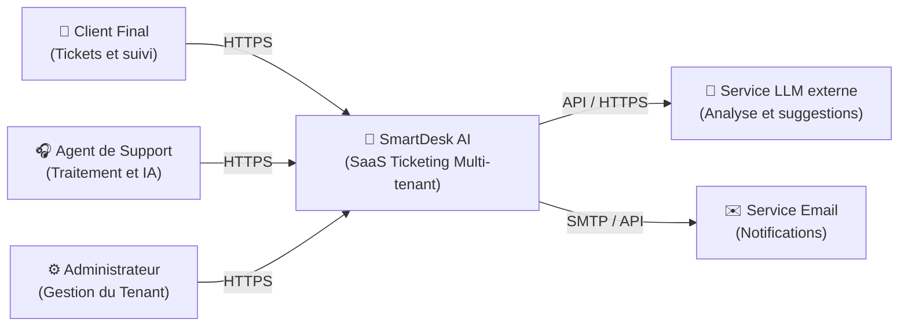
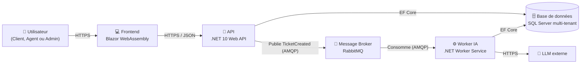
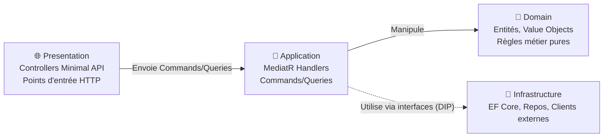

# Dossier de conception technique : SmartDesk AI

Version 1.0, suite du Cahier des Charges Fonctionnel (CDCF:CahierDesChargesFonctionnel.md)

---

## Table des matières

1. Vue d'ensemble architecturale (modèle C4)
2. Modèle de données détaillé
3. Architecture Decision Records (ADR)
4. Flux clés (séquence)
5. Structure de solution .NET

---

## 1. Vue d'ensemble architecturale (modèle C4)

Le modèle C4 permet de documenter l'architecture à différents niveaux de zoom.

### 1.1 Niveau 1 — Contexte système

Qui utilise le système et avec quoi interagit-il ?

### 1.2 Niveau 2 — Conteneurs

 

### 1.3 Niveau 3 — Composants (zoom sur l'API)

 

> **Principe clé (Clean Architecture)** : les flèches de dépendance pointent toujours vers le `Domain`. L'`Infrastructure` dépend de l'`Application` via des interfaces définies dans l'`Application`, jamais l'inverse. C'est ce qui permet de tester le métier sans base de données ni appel réseau.

---

## 2. Modèle de données détaillé.

### 2.1 Diagramme entité-relation