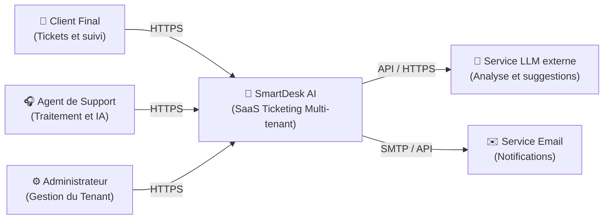
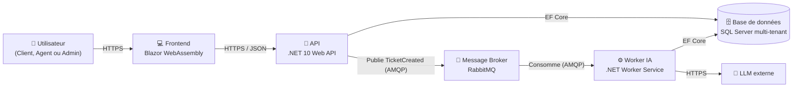
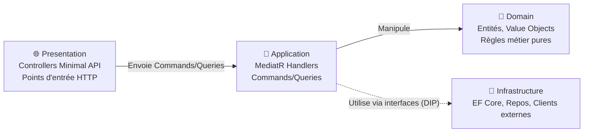
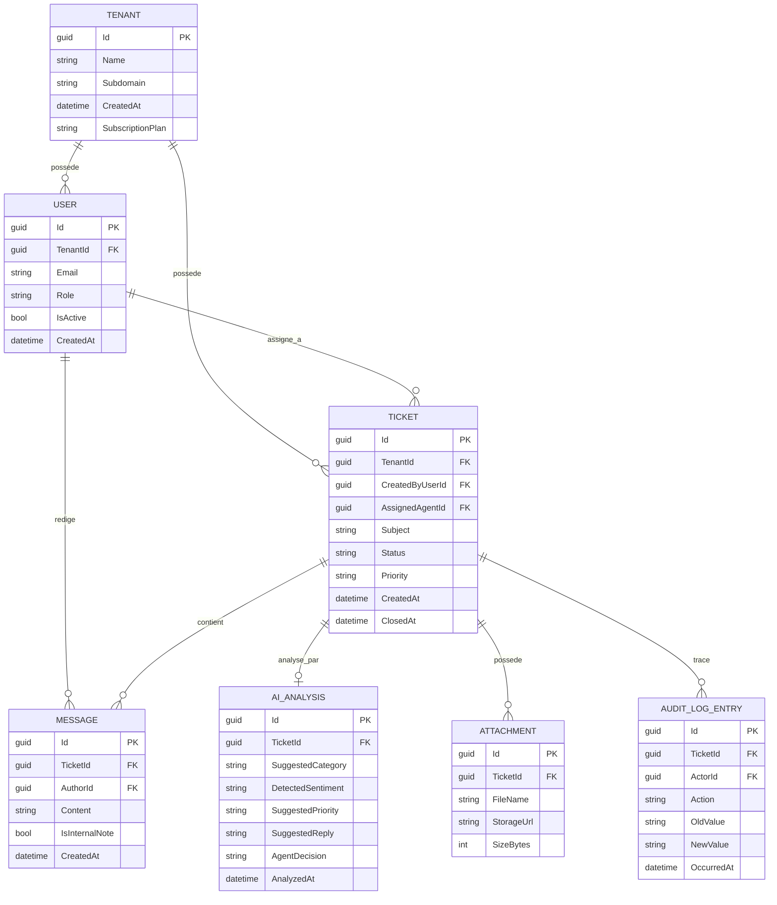
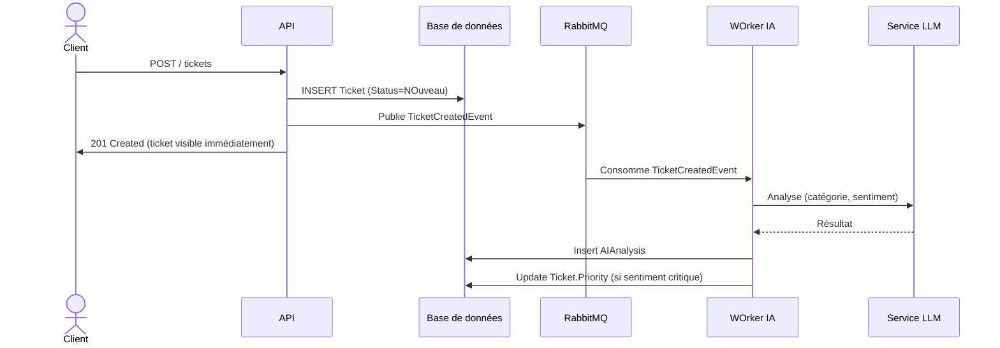

# Dossier de conception technique : SmartDesk AI

Version 1.0, suite du Cahier des Charges Fonctionnel (CDCF:CahierDesChargesFonctionnel.md)

---

## Table des matières

1. Vue d'ensemble architecturale (modèle C4)
2. Modèle de données détaillé
3. Architecture Decision Records (ADR)
4. Flux clés (séquence)
5. Structure de solution .NET

---

## 1. Vue d'ensemble architecturale (modèle C4)

Le modèle C4 permet de documenter l'architecture à différents niveaux de zoom.

### 1.1 Niveau 1 — Contexte système

Qui utilise le système et avec quoi interagit-il ?



<hr style="width: 25%; margin: 50px auto;" />

### 1.2 Niveau 2 — Conteneurs


 
<hr style="width: 25%; margin: 50px auto;" />

### 1.3 Niveau 3 — Composants (zoom sur l'API)

 


> **Principe clé (Clean Architecture)** : les flèches de dépendance pointent toujours vers le `Domain`. L'`Infrastructure` dépend de l'`Application` via des interfaces définies dans l'`Application`, jamais l'inverse. C'est ce qui permet de tester le métier sans base de données ni appel réseau.

---

## 2. Modèle de données détaillé.

### 2.1 Diagramme entité-relation



<hr style="width: 25%; margin: 50px auto;" />

### 2.2 Point d'attention : isolation multi-tenant

Toutes les entités portant un `TenantId` doivent avoir un **Global Query Filter** EF Core configuré dans `OnModelCreating` :

```csharp
modelBuilder.Entity<Ticket>()
    .HasQueryFilter(t => t.TenantId == _currentTenantService.TenantId);
```

Le `_currentTenantService.TenantId` doit provenir **exclusivement** des claims du token d'authentification, jamais d'un paramètre de requête ou de route.

---

## 3. Architecture Decision Records (ADR)

Un ADR documente une décision technique, son contexte et ses alternatives écartées.
 
Chaque ADR est un fichier séparé dans [`docs/adr/`](adr/) (convention standard : un fichier par décision, numéroté) pour rester consultable et versionné indépendamment de ce document.
 
| ADR | Décision |
|---|---|
| [0001](adr/0001-multi-tenant-strategy.md) | Stratégie multi-tenant, Single Database + Discriminator Column |
| [0002](adr/0002-async-ai-processing.md) | Traitement IA asynchrone via message broker |
| [0003](adr/0003-cqrs-mediatr.md) | CQRS avec MediatR |
| [0004](adr/0004-ai-graceful-degradation.md) | Dégradation gracieuse en cas d'échec ou de latence IA |
| [0005](adr/0005-optimistic-concurrency.md) | Verrouillage optimiste pour la concurrence sur un ticket |
| [0006](adr/0006-ai-provider-abstraction.md) | Abstraction du fournisseur IA (`IAIAnalysisService`) |
 
> D'autres ADR seront ajoutés au fil du développement (ex : mécanisme d'authentification, stratégie de cache, gestion des migrations EF Core en multi-tenant).
Un nouveau fichier `000N-titre.md` à chaque nouvelle décision structurante.

 
---


## 4. Flux clés (séquences)

### 4.1 Création d'un ticket avec analyse IA asynchrone



<hr style="width: 25%; margin: 50px auto;" />


> Le client obtient une réponse immédiate, l'enrichissement IA arrive quelques secondes après, sans bloquer personne.


## 5. Structure de la solution
 
```
SmartDeskAI/
├── src/
│   ├── SmartDeskAI.Domain/           # Entités, Value Objects, règles métier pures
│   ├── SmartDeskAI.Application/      # Commands, Queries, Handlers, interfaces
│   ├── SmartDeskAI.Infrastructure/   # EF Core, repos, client LLM, RabbitMQ
│   ├── SmartDeskAI.Api/              # Minimal API, controllers, mapping DTO
│   ├── SmartDeskAI.Worker/           # Worker service consommant la queue IA
│   └── SmartDeskAI.Web/              # Blazor WebAssembly
├── tests/
│   ├── SmartDeskAI.Domain.Tests/
│   ├── SmartDeskAI.Application.Tests/
│   └── SmartDeskAI.IntegrationTests/ # Dont tests d'isolation multi-tenant  
├── docs/
│   ├── CahierDesChargesFonctionnel.md
│   ├── ConceptionTechnique.md
│   └── adr/
│   └── images/
├── README.md
└── SmartDeskAI.sln
```