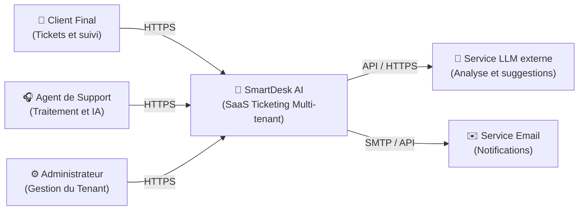
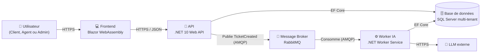
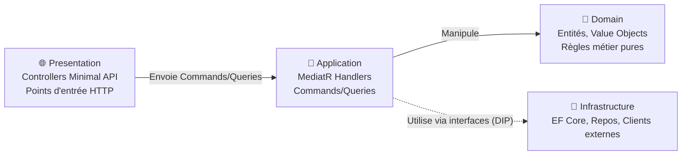
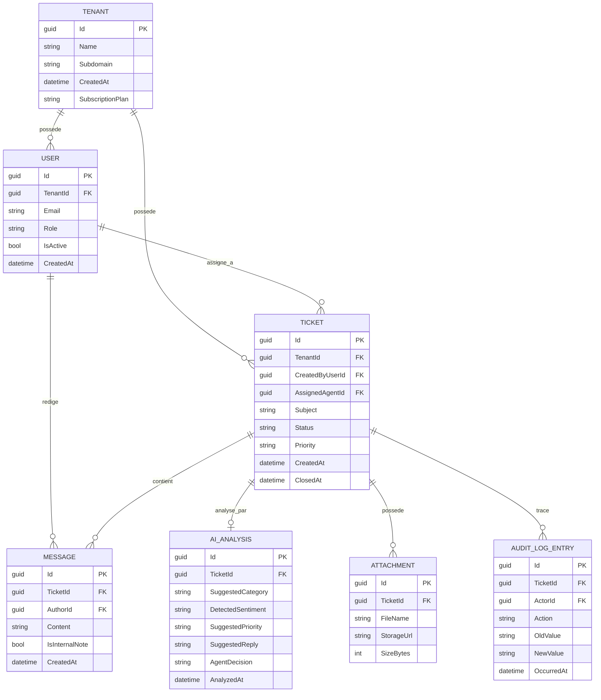
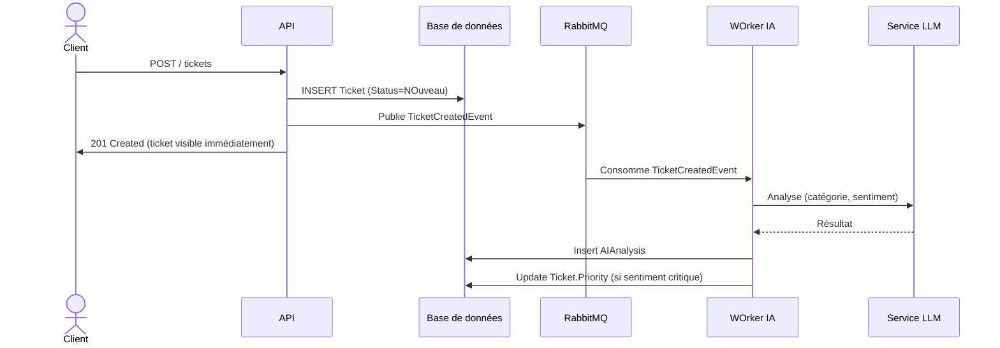

# Dossier de conception technique : SmartDesk AI

Version 1.0, suite du Cahier des Charges Fonctionnel (CDCF:CahierDesChargesFonctionnel.md)

---

## Table des matières

1. Vue d'ensemble architecturale (modèle C4)
2. Modèle de données détaillé
3. Architecture Decision Records (ADR)
4. Flux clés (séquence)
5. Structure de solution .NET

---

## 1. Vue d'ensemble architecturale (modèle C4)

Le modèle C4 permet de documenter l'architecture à différents niveaux de zoom.

### 1.1 Niveau 1 — Contexte système

Qui utilise le système et avec quoi interagit-il ?



<hr style="width: 25%; margin: 50px auto;" />

### 1.2 Niveau 2 — Conteneurs


 
<hr style="width: 25%; margin: 50px auto;" />

### 1.3 Niveau 3 — Composants (zoom sur l'API)

 


> **Principe clé (Clean Architecture)** : les flèches de dépendance pointent toujours vers le `Domain`. L'`Infrastructure` dépend de l'`Application` via des interfaces définies dans l'`Application`, jamais l'inverse. C'est ce qui permet de tester le métier sans base de données ni appel réseau.

---

## 2. Modèle de données détaillé.

### 2.1 Diagramme entité-relation



<hr style="width: 25%; margin: 50px auto;" />

### 2.2 Point d'attention : isolation multi-tenant

Toutes les entités portant un `TenantId` doivent avoir un **Global Query Filter** EF Core configuré dans `OnModelCreating` :

```csharp
modelBuilder.Entity<Ticket>()
    .HasQueryFilter(t => t.TenantId == _currentTenantService.TenantId);
```

Le `_currentTenantService.TenantId` doit provenir **exclusivement** des claims du token d'authentification, jamais d'un paramètre de requête ou de route.

---

## 3. Architecture Decision Records (ADR)

Un ADR documente une décision technique, son contexte et ses alternatives écartées.

### ADR-001 : Stratégie multi-tenant, Single Database + Discriminator Column

- **Statut** : Accepté
- **Contexte** : besoin d'isoler les données de plusieurs entreprises clientes.
- **Options considérées** :
  - Option 1 : base de données dédiée par tenant (isolation maximale, coût opérationnel élevé)
  - Option 2 : schéma dédié par tenant (isolation moyenne, complexité de migration)
  - Option 3 : single database + colonne discriminante `TenantId` (isolation logique, coût faible)
- **Décision** : option 3, via Global Query Filters EF Core.
- **Conséquences** : nécessite une discipline stricte de tests d'intégration pour garantir qu'aucune requête ne contourne le filtre (ex : requêtes SQL brutes à proscrire ou à sécuriser manuellement).

<hr style="width: 25%; margin: 50px auto;" />

### ADR-002 : Traitement IA asynchrone via message broker

- **Statut** : accepté.
- **Contexte** : l'appel à un LLM externe peut prendre plusieurs secondes, il ne doit pas bloquer la création d'un ticket.
- **Options considérées** :
  - Option 1 : appel synchrone dans la requête HTTP (latence subie par l'utilisateur)
  - Option 2 : background job in-process (`IHostedService`) sans broker (perte de messages si le process redémarre)
  - Option 3 : message broker (RabbitMQ) + worker dédié
- **Décision** : Option 3.
- **Conséquences** : ajoute un composant d'infrastructure supplémentaire mais garantit la résilience (les messages non traités restent dans la queue) et la scalabilité indépendante du worker.
  
<hr style="width: 25%; margin: 50px auto;" />

### ADR-003 : CQRS avec MediatR

- **Statut** : accepté.
- **Contexte** : séparer les cas d'usage de lecture (queries, souvent optimisés, DTO plats) des cas d'usage d'écriture (commands avec validation et règles métier).
- **Décision** :  un handler MediatR par Command/Query, validation via FluentValidation en pipeline behavior.
- **Conséquences** : plus de fichiers qu'une approche "service classique" mais chaque cas d'usage est isolé, testable unitairement et le code rese lisible même quand le projet grossit.

<hr style="width: 25%; margin: 50px auto;" />

### ADR-004 : Dégradation gracieuse en cas d'échec ou de latence IA

- **Statut** : accepté
- **Contexte** : un appel au LLM peut échouer ou traîner indéfiniment, le service de ticketing ne dois jamais dépendre de la disponibilité de l'IA pour fonctionner.
- **Décision** : timeout de 10 secondes sur l'appel au LLM, un retry automatique (backoff 2s) puis abandon avec enregistrement d'audit. Le ticket reste pleinement utilisable en mode manuel en cas d'échec.
- **Conséquences** : l'agent peut se retrouver sans suggestion IA sur certains tickets, cela reste acceptable mais le service principal, le ticketing n'est jamais bloqué par un tiers externe.

### ADR-005 : Verrouillage optimiste pour la concurrence sur un ticket

- **Statut** : accepté
- **Contexte** : deux agents peuvent modifier le même ticket simultanément
- **Options considérées** :
  - Option 1 : verrouillage pessimiste, lock en base et complexité opérationnelle, risque de deadlock.
  - Option 2 : verrouillage optimiste (`RowVersion`, `ConcurrencyToken` EF Core) standard, peu de code.
  - Option 3 : indicateur de présence en temps réel (SignalR), meilleure UX mais infra supplémentaire non justifié pour un MVP
- **Décision** : option 2 pour le MVP mais option 3 envisageable en V3.
- **Conséquences** : en cas de modification concurrente, le second agent qui tente d'enregistrer ses changements reçoit une erreur de concurrence et doit recharger le ticket.

### ADR-006 : Abstraction du fournisseur IA (`IAIAnalysisService`)

- **Statut** : accepté
- **Contexte** : projet mené sans budget, besoin de pouvoir utiliser un LLM gratuit ou local (Ollama, Mistral) pendant le développement, sans figer un fournisseur payant dans le code métier.
- **Décision** : toute interaction avec un LLM passe par l'interface `IAIAnalysisService`, définie côté Application. L'implémentation concrète (Infrastructure) est substituable sans impact sur le reste du système.
- **Conséquences** : léger surcoût de conception au départ mais permet de changer de fournisseur (Ollama en local, Mistral API, ou un fournisseur payant plus tard) sans toucher au Domain ni à l'Application. Facilite aussi les tests (mock de l'interface). Point d'attention RGPD, si un fournisseur externe est utilisé, où les données ne sortent jamais de la machine, cela constitue une sous-tratance de données à documenter dans les CGU.

> D'autres ADR seront ajoutés au fil du développement (ex : mécanisme d'authentification, stratégie de cache, gestion des migrations EF Core en multi-tenant).

## 4. Flux clés (séquences)

### 4.1 Création d'un ticket avec analyse IA asynchrone



> Le client obtient une réponse immédiate, l'enrichissement IA arrive quelques secondes après, sans bloquer personne.

## 5. Structure de solution .NET
 
```
SmartDeskAI/
├── src/
│   
├── docs/
│   ├── CahierDesChargesFonctionnel.md
│   ├── ConceptionTechnique.md
│   └── adr/
├── README.md
└── SmartDeskAI.sln
```