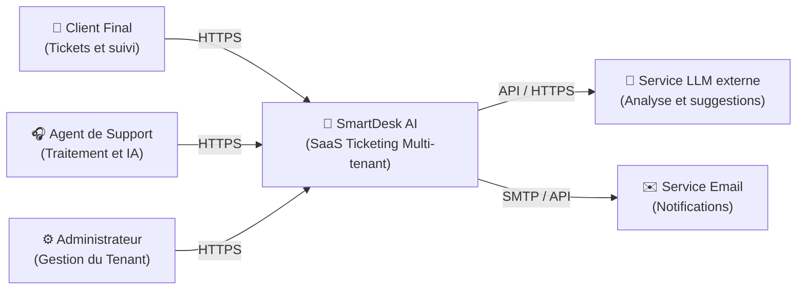
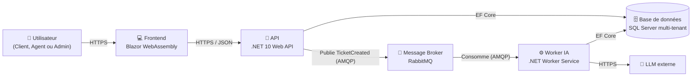
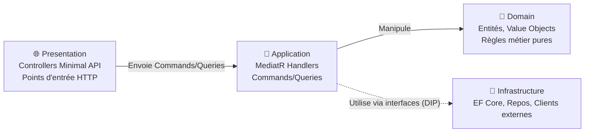
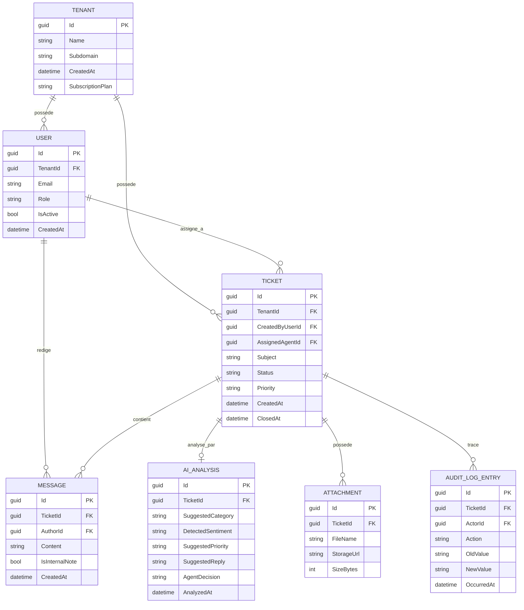

# Dossier de conception technique : SmartDesk AI

Version 1.0, suite du Cahier des Charges Fonctionnel (CDCF:CahierDesChargesFonctionnel.md)

---

## Table des matières

1. Vue d'ensemble architecturale (modèle C4)
2. Modèle de données détaillé
3. Architecture Decision Records (ADR)
4. Flux clés (séquence)
5. Structure de solution .NET

---

## 1. Vue d'ensemble architecturale (modèle C4)

Le modèle C4 permet de documenter l'architecture à différents niveaux de zoom.

### 1.1 Niveau 1 — Contexte système

Qui utilise le système et avec quoi interagit-il ?



<hr style="width: 25%; margin: 50px auto;" />

### 1.2 Niveau 2 — Conteneurs


 
<hr style="width: 25%; margin: 50px auto;" />

### 1.3 Niveau 3 — Composants (zoom sur l'API)

 


> **Principe clé (Clean Architecture)** : les flèches de dépendance pointent toujours vers le `Domain`. L'`Infrastructure` dépend de l'`Application` via des interfaces définies dans l'`Application`, jamais l'inverse. C'est ce qui permet de tester le métier sans base de données ni appel réseau.

---

## 2. Modèle de données détaillé.

### 2.1 Diagramme entité-relation



<hr style="width: 25%; margin: 50px auto;" />

### 2.2 Point d'attention : isolation multi-tenant

Toutes les entités portant un `TenantId` doivent avoir un **Global Query Filter** EF Core configuré dans `OnModelCreating` :

```csharp
modelBuilder.Entity<Ticket>()
    .HasQueryFilter(t => t.TenantId == _currentTenantService.TenantId);
```

Le `_currentTenantService.TenantId` doit provenir **exclusivement** des claims du token d'authentification, jamais d'un paramètre de requête ou de route.

---

## 3. Architecture Decision Records (ADR)

Un ADR documente une décision technique, son contexte et ses alternatives écartées.

### ADR-001 : Stratégie multi-tenant, Single Database + Discriminator Column

- **Statut** : Accepté
- **Contexte** : besoin d'isoler les données de plusieurs entreprises clientes.
- **Options considérées** :
  - Option 1 : Base de données dédiée par tenant (isolation maximale, coût opérationnel élevé)
  - Option 2 : Schéma dédié par tenant (isolation moyenne, complexité de migration)
  - Option 3 : Single database + colonne discriminante `TenantId` (isolation logique, coût faible)
- **Décision** : Option 3, via Global Query Filters EF Core.
- **Conséquences** : nécessite une discipline stricte de tests d'intégration pour garantir qu'aucune requête ne contourne le filtre (ex : requêtes SQL brutes à proscrire ou à sécuriser manuellement).

<hr style="width: 25%; margin: 50px auto;" />

